# Automated ELK Stack Deployment

The files in this repository were used to configure the network depicted below.

This document contains the following details:
- Description of the Topology
- Access Policies
- ELK Configuration
  - Downloading and Configuring the Container
  - How to Use the Ansible Build
  - Launching and Exposing the Container
  - Identity and Access Management
  - Beats in Use
  - Machines Being Monitored
- Target Machines & Beats

These files have been tested and used to generate a live ELK deployment on Azure. They can be used to either recreate the 
entire deployment pictured below. Alternatively, select portions of the Filebeat-Playbook.yml file may be used to install only 
certain pieces of it, such as Filebeat.  Here is an example of the filebeat-playbook.yml used within this ELK Stack Deployement.

- Filebeat-Playbook.yml

![]https://github.com/nikkicole79/ELK_Server-Deployment_Project/blob/main/Ansible/Filebeat-Playbook.yml

# Description of the Topology ###

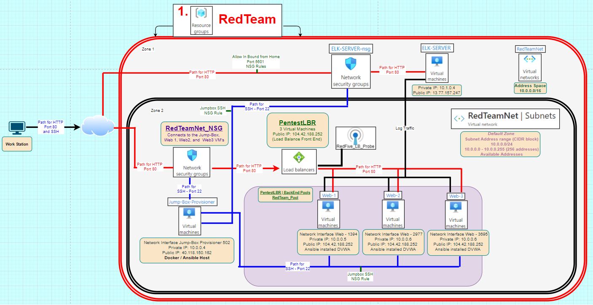

Below is the google drive link as well to the ELK Stack Deployment Diagram 
![]https://drive.google.com/drive/folders/1qabkFzc6OKWVc4VX9JYaLMf2bmkCaK8v?usp=sharing

The main purpose of this network is to expose a load-balanced and monitored instance of DVWA, the D*mn Vulnerable Web Application.

Load balancing ensures that the application will be highly available, in addition to restricting inbound access to the network.  
The load balancer sites between the client and the server and provides additional security, performance, resilience and simply scaling of 
the network.

	- Security - Adding additional layers of security
	            - Protect applications from emerging threats
		    - Authenticate User Access
		    - Protect again DDoS attacks by detecting and dropping DDoS traffic
		    - Simplify PCI compiance
		    
	- Performance - Load balancers reduce the load on the web sever and optimize the traffic resulting in more resources for the application
	
	- Resilience -  Load balancers maintain continue service if a web service fails or is busy will continue to provide or redirect traffic to 
		         the remaining servers with no impact to the user
			 
	- Scalability - Easy to makes changes to the server infrastructure without disrupting existing service to users 
 

The advantage of the JumpBox is it prevents the additional VM's from being exposed to the public.  The JumpBox is the single virutal machine that 
connects 2 networks.

Integrating an ELK server allows users to easily monitor the vulnerable VMs for changes to the file system of the VMs on the network and the system 
metrics, such as CPU usage; attempted SSH logins; sudo esclations failures, etc.  

Beats are special-purpose data collection modules.  Rather than collecting all of a machine's log data, Beats allow the user to collect only the very 
specific pieces you are interested in.  Filebeat and Metricbeat were used in the ELK Deployment.

- Filebeat collects data about the file system and monitors for suspicious changes.
- Metricbeat collects specific machine metrics in the network, such as CPU usage and uptime.  

	- A metric is simply a measurement about an aspect of a system that tells analysts how "healthy" it is. Common metrics include:
	
		- CPU usage: The heavier the load on a machine's CPU, the more likely it is to fail. Analysts often receive alerts when CPU usage gets 
                  too high.
		  
                - Uptime: Uptime is a measure of how long a machine has been on. Servers are generally expected to be available for a certain                           percentage of the so analysts typically track uptime to ensure their deployments meet service-level agreements (SLA 

The configuration details of each machine may be found below.

| Name     | Function | IP Address | Operating System |
|----------|----------|------------|------------------|
| Jump Box | Gateway  |  10.0.0.4  |      Linux       |
| DVWA1    |Web Server|  10.0.0.5  |      Linux       |
| DVWA2    |Web Server|  10.0.0.6  |      Linux       |
| DVWA3    |Web Server|  10.0.0.7  |      Linux       |
|  ELK     |Monitoring|  10.1.0.4  |      Linux       |

In addition to the confgiruation above, Azure has provisioned a load balancer in front of the 3 Web Server Virtual Machines except for the jump box.  The load balance is configured into the following zones:

* Zone 1: DVWA 1, DVWA 2, and DVWA3
* Zone 2: ELK

# Access Policies ###

The machines on the internal network are not exposed to the public Internet. 

Only the JumpBox machine can accept connections from the Internet. Access to this machine is only allowed from the following IP addresses: 40.118.150.162

Machines within the network can only be accessed by each other.  The DVWA 1, DVWA 2, and DVWA 3 VM's send traffic to the ELK server.

A summary of the access policies in place can be found in the table below.

| Name     | Publicly Accessible | Allowed Addresses    | 
|----------|---------------------|----------------------|
| Jump Box |        Yes          |    40.118.150.162    |
|   ELK    |        No           |    10.1.0.4          |    
|  DVWA 1  |        No           |    10.0.0.5          |    
|  DVWA 2  |        No           |    10.0.0.6          |    
|  DVWA 3  |        No           |    10.0.0.7          |

  
# ELK Configuration ###

Ansible was used to automate configuration of the ELK machine. No configuration was performed manually, which is advantageous due to the following:

   - One-click: Run from the command line to run the script once and everything is setup. Such as making sure a service is running, trigger updates or      reboots 

   - Modular: Only one program per script, this way I can spread the programs across different servers.

   - Simple:Scripts are extremely simple and don’t need any other software installed.

   - Agnostic: Most programmers can figure out shell and don’t need to know how to use a specific program.

   - Versioning: Since my code is on GitHub a simple Git pull and restart all of supervisor will run my latest code.

   - Agentless: Finally, Ansible is completely agentless. There are no agents/software or additional firewall ports that you need to install on the  
     client systems or hosts which you want to automate.

   - Powerful & Flexible: Ansible has powerful features that can enable you to model even the most complex IT workflows. It can manage the           infrastructure, networks, operating systems and services that you are already using, as Ansible provides you with hundreds of modules to manage them.

   - Efficient: No extra software on your servers means more resources for your applications. Also, since Ansible modules work via JSON, Ansible is    extensible with modules written in a programming language. Ansible introduces modules as basic building blocks for software and cab be customizable based on the needs.

   - Automatic step-by-step reporting : Ansible encourages you to name each ‘task’ in your provisioning script, and then reports whether or not that task succeeded with-or-without changes, or failed, and any error messages. All colour coded.

# Downloading and Configuring the Container ###
  * Create a new Ansible Playbook to use for the ELK virtual machine
  * The Playbook should then install the following services:
	- Install docker.io
	- Install python3-pip
	- Install docker, which is the Docker Python pip module
	- Increase virtual memory
	- Download and launch a docker ELK container

# How to Use the Ansible Build ###

  * sudo docker start [container]
  * sudo docker attach [container]
	- After attaching the container the prompt will change to root
  * root@b2ba789660ad:
  * Change directories to cd /etc/ansible and update the hosts file
  * root@b2ba789660ad:/etc/ansible# nano hosts
      - Add the new VM to the Ansible hosts file 
      - Update the IP addresses under Example #2. 
      - Below is the Ex 2 section where the IP Addresses are added to the hosts file 
    
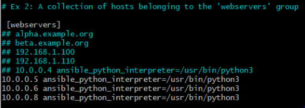
	

- This is the default ansible 'hosts' file.

   - It should live in /etc/ansible/hosts

   - Under Ex 2 section update the hosts belonging to the 'webservers' group
   	- Configuration in this example add 3 web server IP addresses
	- Use the link below for the hosts file.MD
	
https://github.com/nikkicole79/ELK_Server-Deployment_Project/blob/main/Ansible/hosts_file.MD
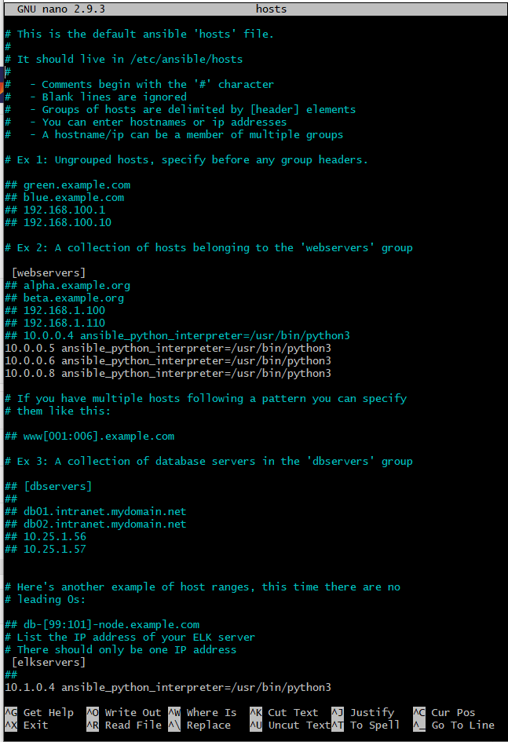

# Launching and Exposing the Container ###
  * sudo docker start [container]
  * sudo docker attach [container]
	- After attaching the container the prompt will change to root
  * root@b2ba789660ad:
  * Change directories to cd /etc/ansible
  * Create the ELKplaybook.yml using nano
  * root@b2ba789660ad:/etc/ansible# nano ELKplaybook.yml

ELKplaybook.yml is displayed below along with the link to the yml file

![]https://github.com/nikkicole79/ELK_Server-Deployment_Project/blob/main/Ansible/ELKplaybook.yml
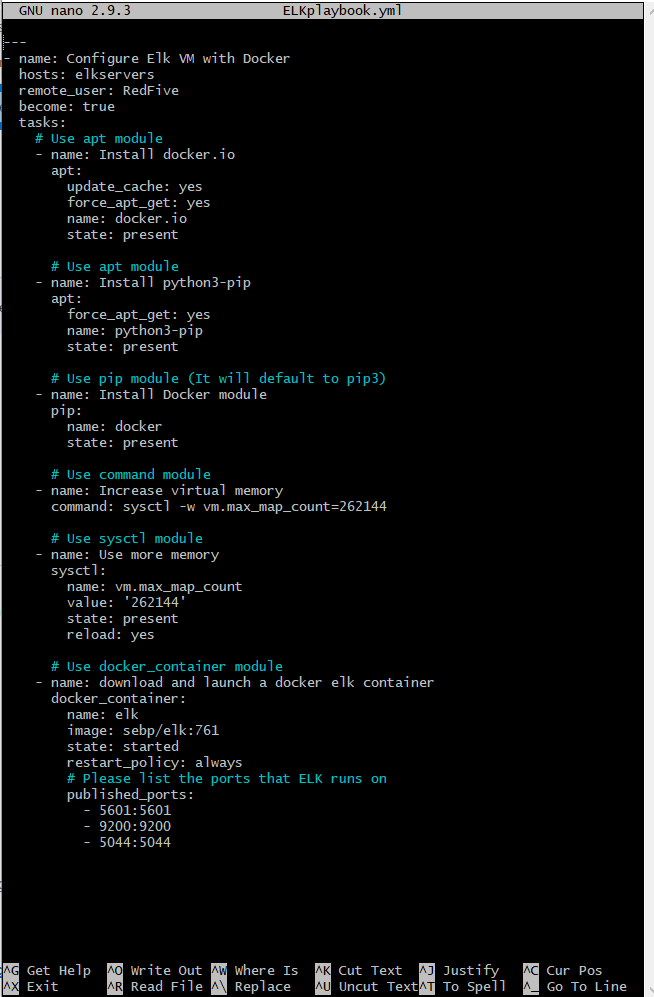

The Ansible output should resemble the output below and not contain any errors:
  
root@b2ba789660ad:/etc/ansible# ansible-playbook ELKplaybook.yml

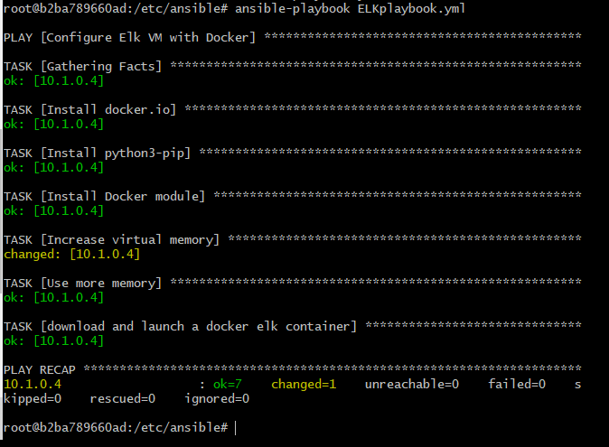

After the ELK container is installed SSH to the container to verify the ELK container is running.  

The following screenshot displays the result of running `docker ps` after successfully configuring the ELK instance.

RedFive@ELK-SERVER:~$ sudo docker ps

 

# Identity and Access Management ###

After verify the ELK container is running you should be able to connect to the webpage.  This ELK web serve runs on port 5601 

Load the ELK stack server from the browser at http://[your.VM.IP]:5601/app/kibana

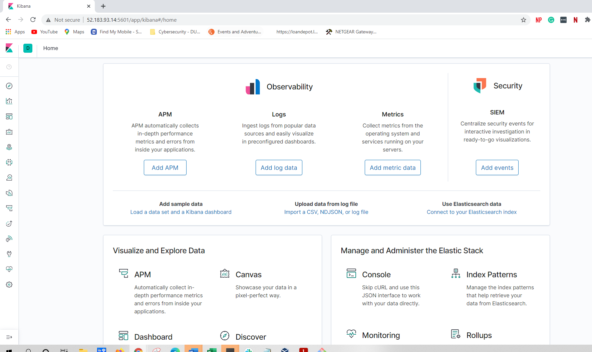

  - In the event you do not see the Kibana / ELK server landing page ensure to SSH into the ELK sever to start and verify it's running.

RedFive@ELK-SERVER:~$ sudo docker container list -a

RedFive@ELK-SERVER:~$ sudo docker start elk

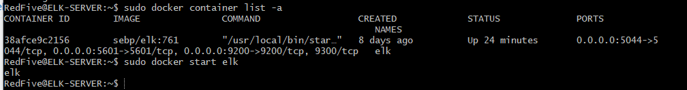

# Beats in Use ###

##Install Filebeat on the DVWA Virtual Machine:
  - Open ELK server homepage
	- Click on Add Log Data
	
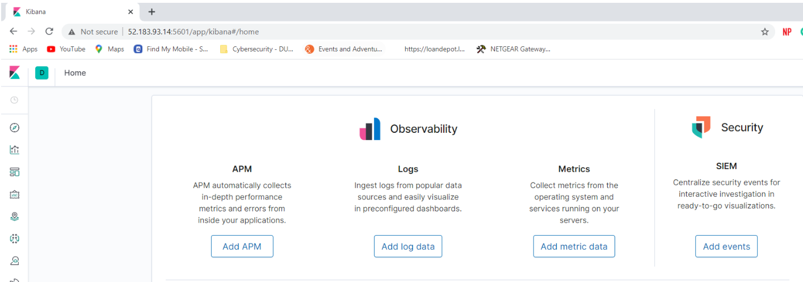

	- Choose System Logs
	
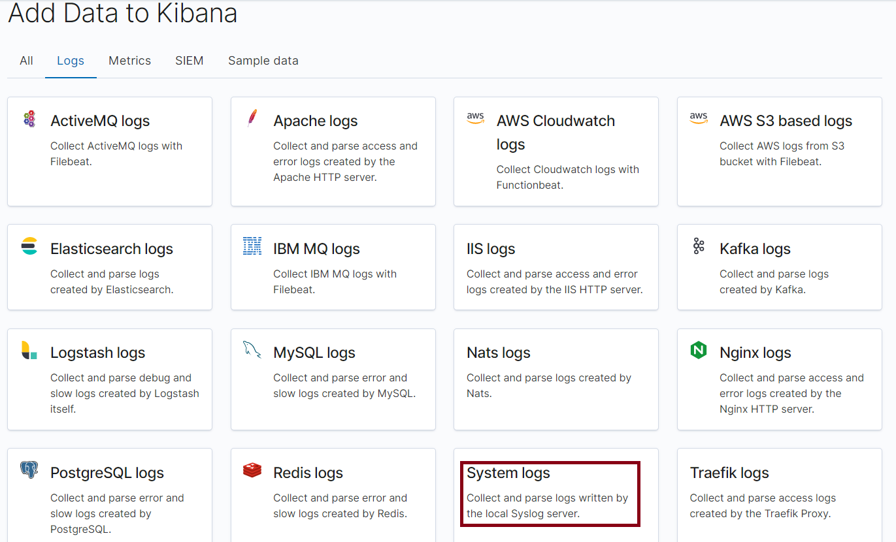

	- Click on DEB tab under Getting Started to vew the correct Linux Filebeat installation instructions
        - Under the Download and install Filebeat section click the Copy snippet button to get the curl command
	
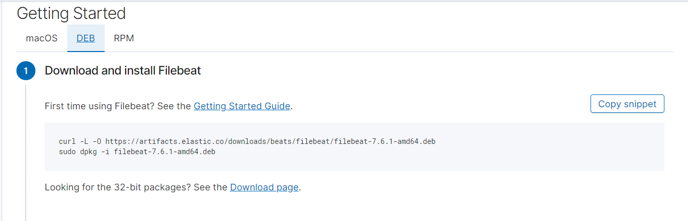

  - Create the Filebest Configuration File with the correct setting to work with the ELK server
 
	- Start Ansible container
	- SSH into the Ansible Container
        - Using curl is a better way to avoid errors and prevents corrupts configuration file

root@6160a9be360e:/etc/ansible# curl -L -O https://artifacts.elastic.co/downloads/beats/filebeat/filebeat-7.6.1-amd64.deb
sudo dpkg -i filebeat-7.6.1-amd64.deb

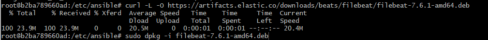

  - Once the file is on the ansible container, edit the host IP under the Elasticsearch output and Kibana

root@b2ba789660ad:/etc/ansible# nano filebeat-config.yml

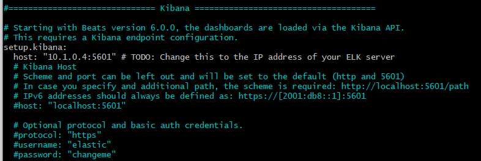

Create the Filebeat Installation Playbook.  The playbook implements the following tasks:
  -Download the .deb file from artifacts.elastic.co.
  -Install the .deb file using the dpkg command shown below: 
     -dpkg -i filebeat-7.4.0-amd64.deb
  -Copy the Filebeat configuration file from your Ansible container to your WebVM's where you just installed Filebeat. 
     -You can use the Ansible module copy to copy the entire configuration file into the correct place.
     -You will need to place the configuration file in a directory called files in your Ansible directory.
  -Run the Filebeat modules enable system command.
  -Run the Filebeat setup command.
  -Run the Filebeat start command.

root@b2ba789660ad:/etc/ansible# nano filebeat-playbook.yml

- Filebeat-Playbook.yml

![]https://github.com/nikkicole79/ELK_Server-Deployment_Project/blob/main/Ansible/Filebeat-Playbook.yml

  - Once the host IP address has been updated into the filebeat-config.yml file run the Ansible Playbook

root@b2ba789660ad:/etc/ansible# ansible-playbook filebeat-playbook.yml

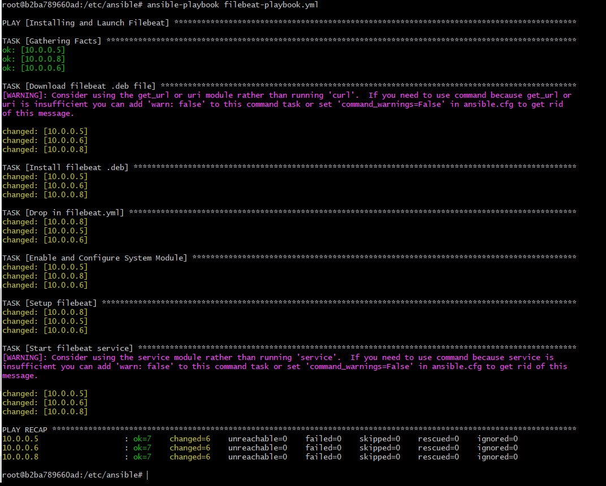

- Click the Log Data button 
- Click on the system logs
- Under Module Status section and Click Check Data
- Scroll to the bottom and click on Verify Incoming Data
- If the ELK Stack was successful you will see the recieving logs

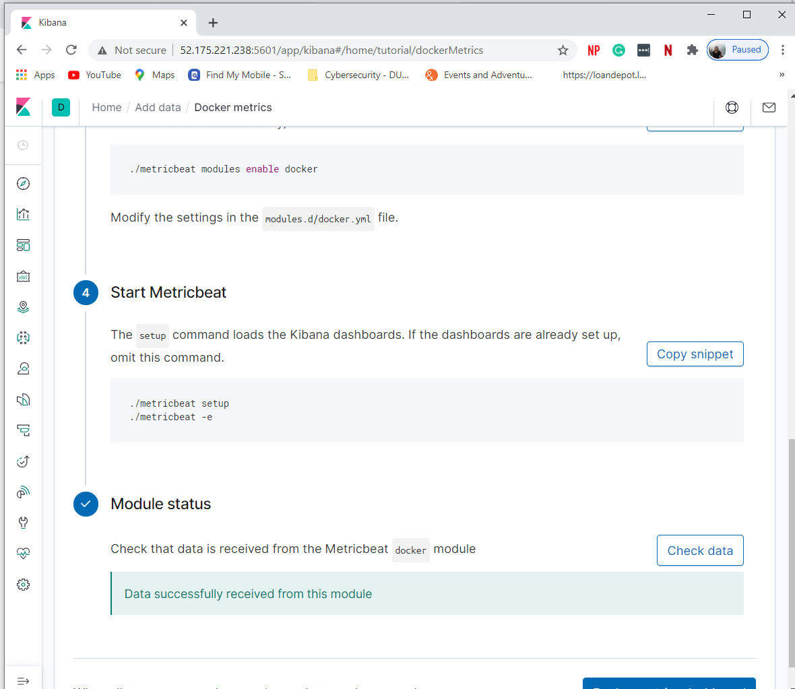

## Install Metricbeat on the DVWA Virtual 

  - Click Add Metric Data
 

  - Click Docker Metrics.
  
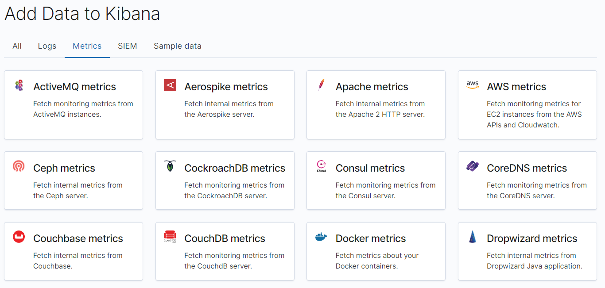

  - Click the DEB tab under Getting Started for the correct Linux instructions.
  - Using curl is a better way to avoid errors and prevents corrupts configuration file

  
 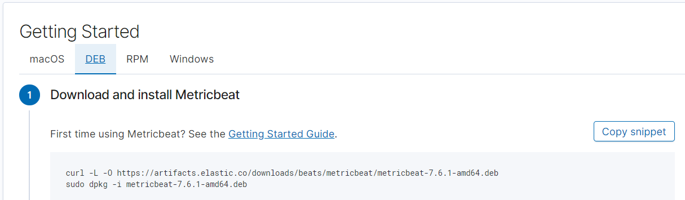
 
 root@6160a9be360e:/etc/ansible# curl -L -O https://artifacts.elastic.co/downloads/beats/metricbeat/metricbeat-7.6.1-amd64.deb

 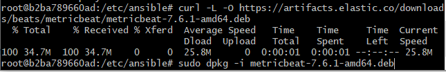

To verify that your play works as expected, on the Metricbeat installation page in the ELK server GUI, scroll to Step 5: Module Status and click check data

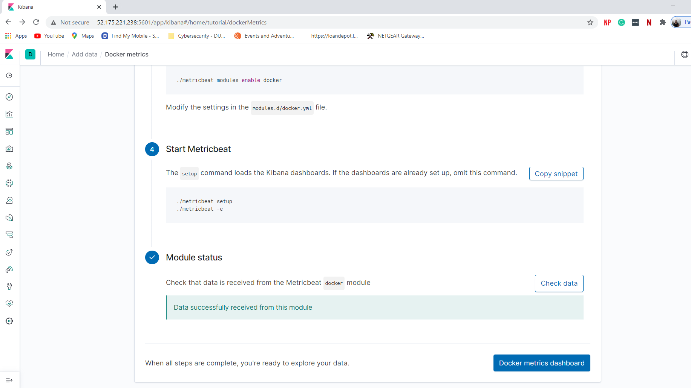

The Dashboard should return data as displayed below

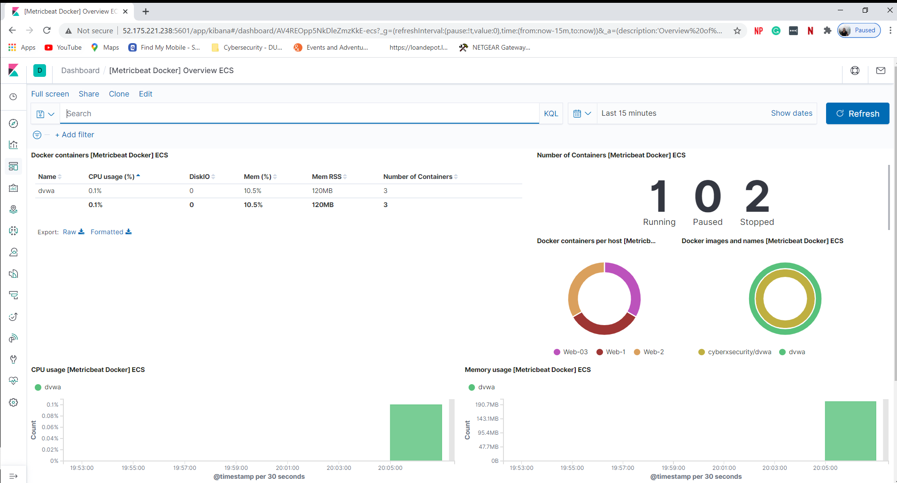

### Target Machines & Beats ###
This ELK server is configured to monitor the following machines: 10.0.0.5, 10.0.0.6, and 10.0.0.8

We have installed the following Beats on these machines:
- Filebeat
- Metricbeat

These Beats allow us to collect the following information from each machine:
- Filebeat: Filebeat detects changes to the filesystem. Specifically, we use it to collect Apache logs.
- Metricbeat: Metricbeat detects changes in system metrics, such as CPU usage. We use it to detect SSH login 
  attempts, failed sudo escalations, and CPU/RAM statistics.

### Using the Playbook ###
In order to use the playbook, you will need to have an Ansible control node already configured. We use the jump box for this purpose.

SSH into the control node and follow the steps below:
- Copy the playbooks file to ansible control node (For example VI, Nano, etc)
- Update the yml file to include the tasks that need to be installed, downloaded, copied, or ran.
- Run the playbook, and navigate to the appropriate targets to check that the installation worked as expected.

The easiest way to copy the playbooks is to use Git:
    $ cd /etc/ansible
    $ mkdir files
    # Clone Repository + IaC Files
    $ git clone https://github.com/yourusername/project-1.git
    # Move Playbooks and hosts file Into `/etc/ansible`
    $ cp project-1/playbooks/* .
    $ cp project-1/files/* ./files
    This copies the playbook files to the correct place.
    Next, you must create a hosts file to specify which VMs to run each playbook on. Run the commands below:
    $ cd /etc/ansible
    $ cat > hosts <<EOF
    [webservers]
    10.0.0.5
    10.0.0.6
    10.0.0.8

    [elk]
    10.1.0.4
    EOF

- After this, the commands below run the playbook:
  $ cd /etc/ansible

- After this, the commands below run the playbook:
  $ cd /etc/ansible
  $ ansible-playbook install_elk.yml elk
  $ ansible-playbook install_filebeat.yml webservers
  $ ansible-playbook install_metricbeat.yml webservers

-To verify success, wait five minutes to give ELK time to start up.
-Then, run: curl http://[ELK VM IP]:5601. This is the address of Kibana. If the installation succeeded, this command should print HTML to the consol
